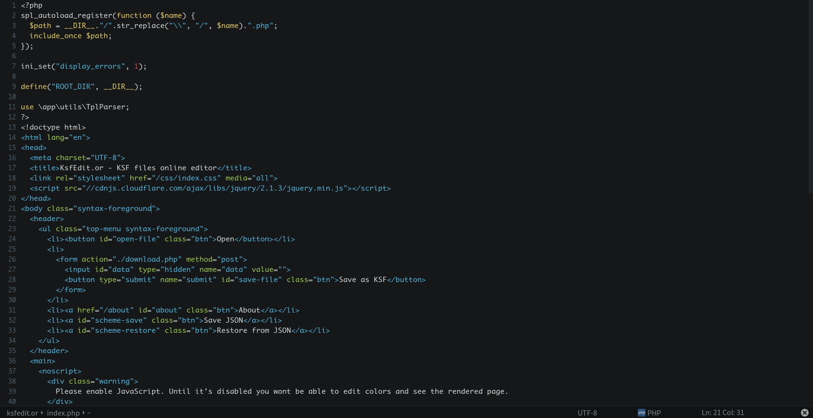

Description
=====================
Flasty color scheme for Komodo 9.
##How to install
* Easy method: Dran'n'drop `Flasty.ksf` onto your Komodo window
* Hard method: find your Komodo profile folder and drop `Flasty.ksf` into `schemes/` folder

##Screenshot

More syntax: http://devbevariour.cf/scheme/flasty